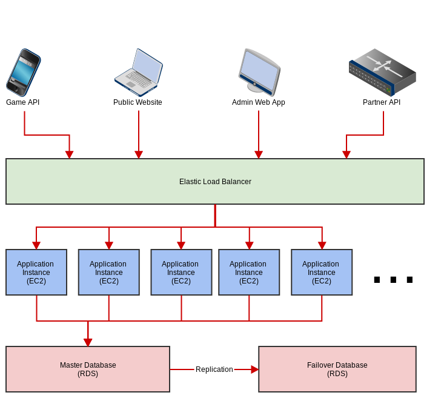

Architecture
============

Interfaces
----------

There are four inbound interfaces to the system:

* The *Game API*, used by mobile apps to spend tokens
* The *Public Website*, used by customers to manage their accounts and make payment
* The *Admin Web App*, used by staff at GToken and game studios to manage the system
* The *Partner API*, used by third-party partner companies to perform special functions such as VIP membership sales

Each API uses a different authentication mechanism and has different functions.

Elastic Load Balancer (*ELB*)
-----------------------------

ELB_ is an Amazon service which balances incoming requests across a number of backend application nodes. It also handles secondary functions such as SSL termination.

.. _ELB: http://docs.aws.amazon.com/ElasticLoadBalancing/latest/DeveloperGuide/SvcIntro.html

Application Instances (EC2)
---------------------------

The application instances run all of the application code. Every instance is identical and can serve requests for any of the available instances. We will initially use two instances (in different availability zones), and increase this number as necessary. Optionally, we can use AWS `Auto Scaling`_ to manage this.

.. _`Auto Scaling`: http://aws.amazon.com/autoscaling/

Database Instances (RDS)
------------------------

We will use AWS' dedicated database instances (`Relational Database Service`_, *RDS*) to run two PostgreSQL databases in a `Multi-AZ Deployment`_.

The database will store both application data and user sessions (but sessions may be moved to a separate cache as a future optimization).

.. _`Relational Database Service`: http://aws.amazon.com/rds/
.. _`Multi-AZ Deployment`: http://aws.amazon.com/rds/faqs/
