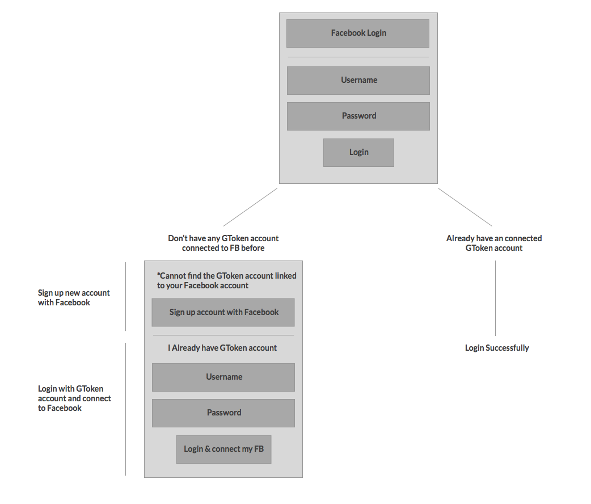
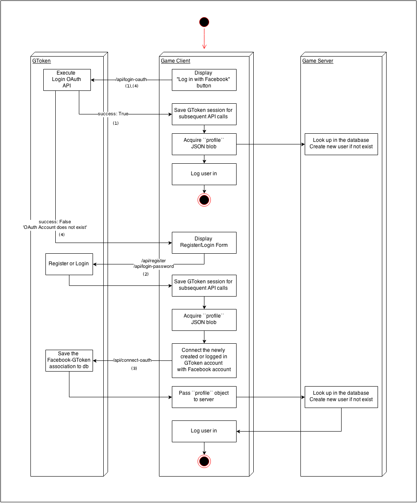
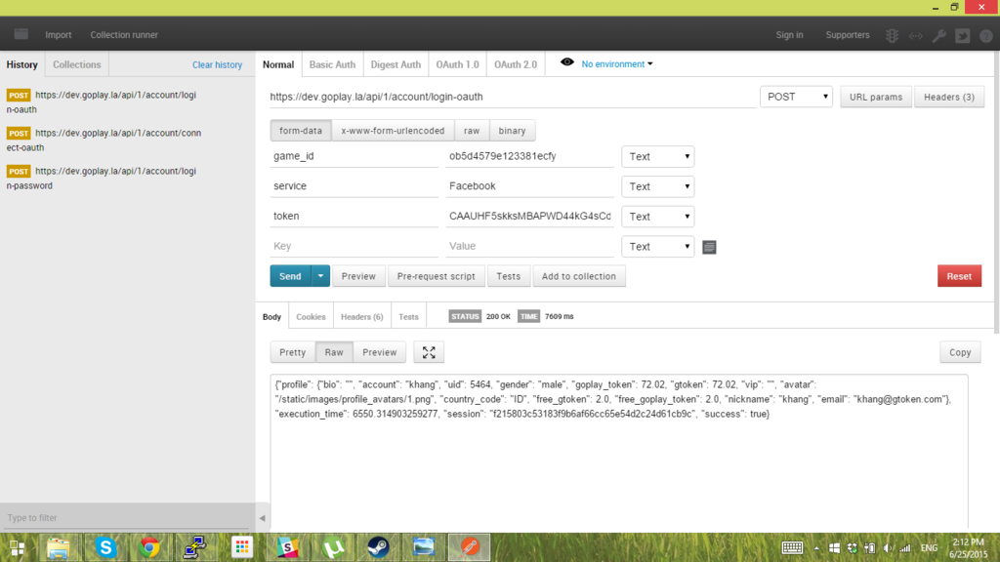
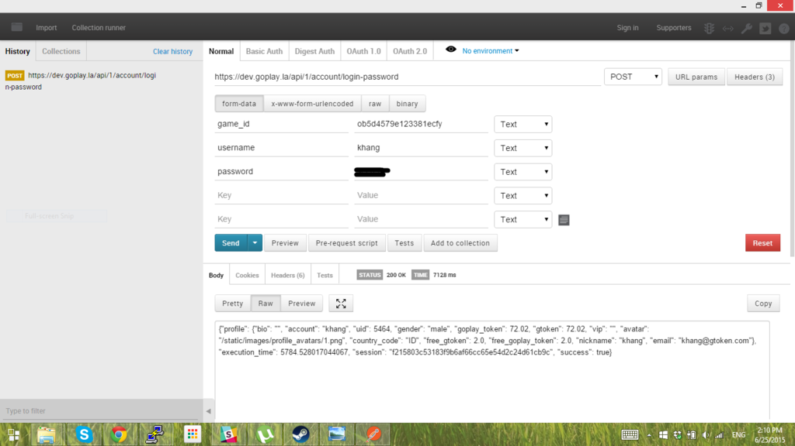
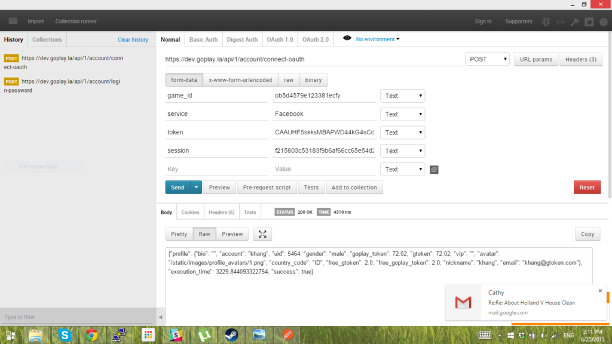
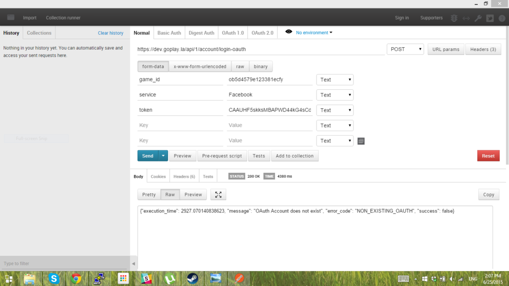
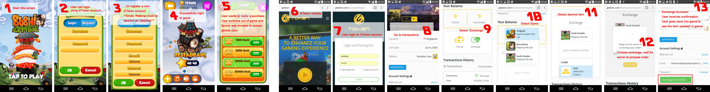
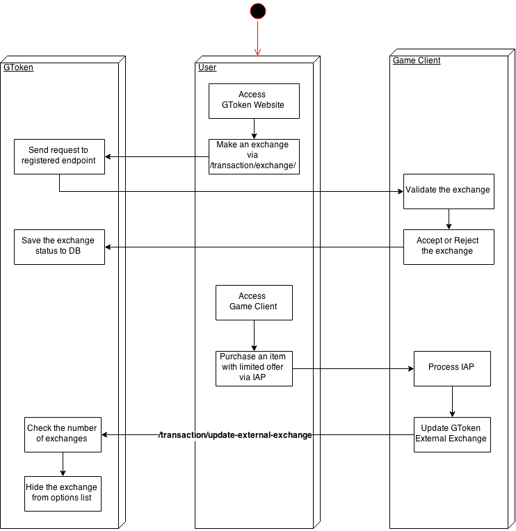
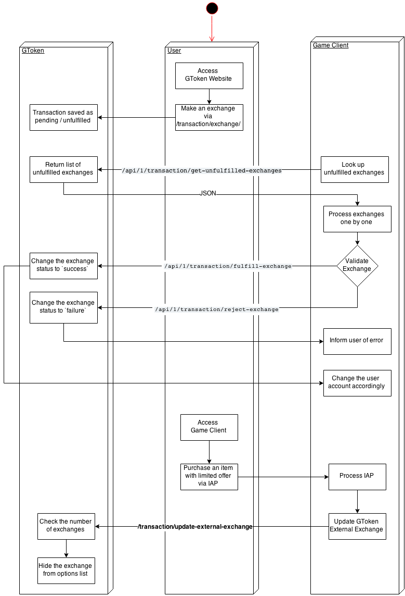

Game API
========

The API listing given here is not intended to be comprehensive. It is intended to give a general structure and address some specific decisions, but other API calls may be added and those given here may be expanded.

.. contents::


Versioning
----------

Every API will include a version number in its URL, e.g.:

* ``/api/1/login``
* ``/api/2/login``

These multiple versions will have separate implementations in the application, and old versions will be kept available for as long as possible. 

An API call can be *extended* without increasing its version number. This usually means adding new optional fields, and modifying the API implementation to use them only if available. The call must still work as expected if the new fields are not present.

If an API call must be changed in a way that breaks existing clients, it should be given a new version.

Each API call may have its own version numbers. The "current" API document for app developers should use the latest version of each call, and these must always be compatible with each other. So, if a new version of one API breaks existing versions of other APIs, those APIs should be given new, compatible versions at the same time (and this should be noted in the documentation).


Common Data Structures
----------------------

Profile
```````

A JSON object representing a customer's account information, with the following keys:

============================= ======= =====================================
Key                           Type    Notes
============================= ======= =====================================
``uid``                       int
``account``                   string  Unique username
``nickname``                  string
``email``                     string
``gender``                    string
``vip``                       string  "standard", "gold", or null
``country_code``              string  Country name
``goplay_token``              decimal Play Token balance
``free_goplay_token``         decimal Free Play Token balance
``gtoken (deprecated)``       decimal Play Token balance
``free_gtoken (deprecated``   decimal Free Play Token balance
============================= ======= =====================================

Exchange
````````

A JSON object representing a exchange information, with the following keys:

================================ ======= =====================================
Key                              Type    Notes
================================ ======= =====================================
``transaction_id``               uuid
``exchange_option_type``         string  'CreditType', or 'Package'
``exchange_option_identifier``   string  Vendor-specified unique string to identify the package/credit
``goplay_token_value``           decimal The value of Play Token of the exchange
``gtoken_value (deprecated)``    decimal The value of Play Token of the exchange
``quantity``                     int     Always be 01 in case ``exchange_option_type`` is ``Package``
``is_free``                      bool    ``True`` when the exchange uses Free Play Token
================================ ======= =====================================


GCoin Transaction
`````````````````

A JSON object representing a exchange information, with the following keys:

================================ ======= =====================================
Key                              Type    Notes
================================ ======= =====================================
``transaction_id``               uuid
``game_id``                      uuid
``gcoin_value``                  decimal The value of GCoin rewarded
``description``                  string
``status``                       string
================================ ======= =====================================

Game
````

A JSON object representing a game distributed by GoPlay:

================================ ======= =====================================
Key                              Type    Notes
================================ ======= =====================================
``id``                           int
``name``                         string
``web_link``                     string  Link to the game page in GoPlay
``game_invite_protocol``         string  Meant to open the game app directly. Not supported at the moment
``icon_filename``                string
``studio``                       string  Studio name
``promotion``                    JSON    Indicate the promotion the game is in. At one time, a game has one promotion max
================================ ======= =====================================

Game Stat
`````````

A JSON object representing a game stat, with the following keys:

================================ ======= =====================================
Key                              Type    Notes
================================ ======= =====================================
``title``                        string
``value``                        string
``public``                       bool    Determine if the stat is visible to public profile or not
================================ ======= =====================================

Friends
`````````

A JSON object representing a friend info, with the following keys:

================================ ======= =====================================
Key                              Type    Notes
================================ ======= =====================================
``uid``                          int
``account``                      string
``email``                        string  
``nickname``                     string  
``vip``                          string  "standard", "gold", or null
``avatar``                       string  
``country_code``                 string  Country name
``bio``                          string  
================================ ======= =====================================

API Calls
---------

``POST /account/register``
``````````````````````````

Used to *explicitly* register a customer account from a mobile app, meaning that the user has indicated they have no existing account, and filled out a registration form in-app.

**Endpoint**: ``/api/1/account/register``

**Request**:

================= ====== ==============================
Parameter         Type   Notes
================= ====== ==============================
``username *``    string Must be unique
``password *``    string 
``email``         string
``nickname``      string
``gender``        string "male", "female", or "other"
``game_id *``     guid
``referral_code`` string
``ip_address``    string If not provided, use the IP address of requester
``country_code``  string If one of two fields: ``country_code`` and ``country name`` not provided, user country will be automatically filled based on ``ip_address`` field.
``country_name``  string
================= ====== ==============================

**Response (JSON)**:

================= ======= ==============================
Key               Type    Notes
================= ======= ==============================
``success``       bool
``message``       string  Human-readable error message
``error_code``    string  Error Code
``session``       string  Access token for later requests
``profile``       profile See ``profile`` definition above
================= ======= ==============================

**Error Messages**:

* EXISTING_USERNAME_EMAIL - 'Account with such username/email already exists'
* MISSING_FIELDS - 'Required field(s) is blank'
* INVALID_GAME_ID - 'Invalid Game ID'
* USERNAME_LENGTH - 'Username is between 3-20 characters'
* INVALID_USERNAME - 'Username does not accept special characters'
* PASSWORD_LENGTH - 'Password must be more than 3 characters'
* INVALID_COUNTRY - 'Invalid country code or country name'

``POST /account/login-password``
````````````````````````````````

Logs a user in via their GToken username and password. The account must already exist.

**Endpoint**: ``/api/1/account/login-password``

**Request**:

================= ====== ==============================
Parameter         Type   Notes
================= ====== ==============================
``username *``    string
``password *``    string
``game_id *``     guid
================= ====== ==============================

**Response (JSON)**:

================= ======= ================================
Key               Type    Notes
================= ======= ================================
``success``       bool
``message``       string  Human-readable error message
``error_code``    string  Error Code
``session``       string  Access token for later requests
``profile``       profile See ``profile`` definition above
================= ======= ================================

**Error Messages**:

* INVALID_USN_PWD - 'Username or Password is incorrect'
* MISSING_FIELDS - 'Required field(s) is blank'
* INVALID_GAME_ID - 'Invalid Game ID'

``POST /account/login-oauth``
`````````````````````````````

Log in via a third-party OAuth provider, e.g. Facebook. Note that this API will **not** implicitly register the user if an account does not already exist, but return an **error message** instead.

**Endpoint**: ``/api/1/account/login-oauth``

**Request**:

================= ====== ==========================================
Parameter         Type   Notes
================= ====== ==========================================
``service *``     string Identifies the third-party service used
``token *``       string Access token returned by third party
``game_id *``     guid
================= ====== ==========================================

**Response (JSON)**

================= ======= ================================
Key               Type    Notes
================= ======= ================================
``success``       bool
``message``       string  Human-readable error message
``error_code``    string  Error Code
``session``       string  Access token for later requests
``profile``       profile See ``profile`` definition above
================= ======= ================================

**Error Messages**:

* NON_EXISTING_OAUTH - 'OAuth Account does not exist'
* MISSING_FIELDS - 'Required field(s) is blank'
* INVALID_GAME_ID - 'Invalid Game ID'
* FACEBOOK_ACCESS_ERROR - 'An active access token must be used to query information about the current user'
* NOT_SUPPORTED_OAUTH_PROVIDER - 'The OAuth Provider is not supported'

.. ``POST /account/connect-password``
.. ``````````````````````````````````

.. Adds a password-based login to an existing account, which must not have one already (i.e. it has only OAuth login).

.. **Endpoint**: ``/api/1/account/connect-password``

.. **Request**:

.. ================= ====== ==========================================
.. Parameter         Type   Notes
.. ================= ====== ==========================================
.. ``session``       string Access token returned by previous login
.. ``game_id``       guid
.. ``username``      string
.. ``password``      string
.. ================= ====== ==========================================

.. **Response (JSON)**

.. ================= ======= ================================
.. Key               Type    Notes
.. ================= ======= ================================
.. ``success``       bool
.. ``message``       string  Human-readable error message
.. ``error_code``    string  Error Code
.. ================= ======= ================================


``POST /account/connect-oauth``
```````````````````````````````

Adds an OAuth login to an existing account. One account may have multiple OAuth logins.

**Endpoint**: ``/api/1/account/connect-oauth``

**Request**:

================= ====== ==========================================
Parameter         Type   Notes
================= ====== ==========================================
``session *``     string Access token returned by previous login
``game_id *``     guid
``service *``     string Identifies the third-party service used
``token *``       string Access token returned by third party
================= ====== ==========================================

**Response (JSON)**

================= ======= ================================
Key               Type    Notes
================= ======= ================================
``success``       bool
``message``       string  Human-readable error message
``error_code``    string  Error Code
================= ======= ================================

**Error Messages**:

* EXISTING_OAUTH - 'OAuth Account already exists'
* INVALID_SESSION - 'Invalid Session'
* MISSING_FIELDS - 'Required field(s) is blank'
* INVALID_GAME_ID - 'Invalid Game ID'
* NOT_SUPPORTED_OAUTH_PROVIDER - 'The OAuth Provider is not supported'

``POST /account/disconnect-oauth``
``````````````````````````````````

Disconnect an OAuth login from an existing account.

**Endpoint**: ``/api/1/account/disconnect-oauth``

**Request**

================= ====== ==========================================
Parameter         Type   Notes
================= ====== ==========================================
``session *``     string Access token returned by previous login
``game_id *``     guid
``service *``     string Identifies the third-party service used
``token *``       string Access token returned by third party
================= ====== ==========================================

**Response (JSON)**

================= ======= ================================
Key               Type    Notes
================= ======= ================================
``success``       bool
``message``       string  Human-readable error message
``error_code``    string  Error Code
================= ======= ================================

**Error Messages**:

* OAUTH_USER_NOT_CONNECTED - 'OAuth Account and Customer Account are not connected'
* NON_EXISTING_OAUTH - 'OAuth Account does not exist'
* INVALID_SESSION - 'Invalid Session'
* MISSING_FIELDS - 'Required field(s) is blank'
* INVALID_GAME_ID - 'Invalid Game ID'
* FACEBOOK_ACCESS_ERROR - 'An active access token must be used to query information about the current user'
* NOT_SUPPORTED_OAUTH_PROVIDER - 'The OAuth Provider is not supported'

``POST /account/check-oauth-connection``
````````````````````````````````````````

Query if the OAuth login (access token) was added to the given account (session).

**Endpoint**: ``/api/1/account/check-oauth-connection``

**Request**

================== ====== ==========================================
Parameter          Type   Notes
================== ====== ==========================================
``session *``      string Access token returned by previous login
``game_id *``      guid
``service *``      string Identifies the third-party service used
``token *``        string Access token returned by third party
================== ====== ==========================================

**Response (JSON)**

================== ======= =========================================
Key                Type    Notes
================== ======= =========================================
``success``        bool    ``True`` indicates the connection was made
``message``        string  Human-readable error message
``error_code``     string  Error Code
================== ======= =========================================

**Error Messages**:

* OAUTH_ALREADY_CONNECTED - 'OAuth Account is connected already'
* NON_EXISTING_OAUTH - 'OAuth Account does not exist'
* MISSING_FIELDS - 'Required field(s) is blank'
* INVALID_GAME_ID - 'Invalid Game ID'
* NOT_SUPPORTED_OAUTH_PROVIDER - 'The OAuth Provider is not supported'

``POST /account/profile``
`````````````````````````

Returns profile of logged-in user. May be used to check whether a session token is still valid.

**Endpoint**: ``/api/1/account/profile``

**Request**

================= ====== ==========================================
Parameter         Type   Notes
================= ====== ==========================================
``session *``     string Access token returned by previous login
``game_id *``     guid
================= ====== ==========================================

**Response (JSON)**

================= ======= ================================
Key               Type    Notes
================= ======= ================================
``success``       bool
``message``       string  Human-readable error message
``error_code``    string  Error Code
``profile``       profile See ``profile`` definition above
================= ======= ================================

**Error Messages**:

* INVALID_SESSION - 'Invalid Session'
* INVALID_GAME_ID - 'Invalid Game ID'

``POST /account/profile-edit``
``````````````````````````````

Updates profile of logged-in user. Parameters may be omitted, and those fields will be unchanged.

**Endpoint**: ``/api/1/account/profile-edit``

**Request**

================= ====== ==========================================
Parameter         Type   Notes
================= ====== ==========================================
``session *``     string Access token returned by previous login
``game_id *``     guid
``email``         string Must be unique
``nickname``      string
``gender``        string "male", "female", or "other"
================= ====== ==========================================

**Response (JSON)**

================= ======= ================================
Key               Type    Notes
================= ======= ================================
``success``       bool
``message``       string  Human-readable error message
``error_code``    string  Error Code
``profile``       profile See ``profile`` definition above
================= ======= ================================

**Error Messages**

* INVALID_SESSION - 'Invalid Session'
* INVALID_GAME_ID - 'Invalid Game ID'

``POST /account/grant-chat-token``
``````````````````````````````````

Grant a user who logged via GToken to access chat system.

**Endpoint**: ``/api/1/account/grant-chat-token``

**Request**:

================= ====== ==============================
Parameter         Type   Notes
================= ====== ==============================
``game_id *``     guid
``session *``     string
================= ====== ==============================

**Response (JSON)**:

================= ======= ================================
Key               Type    Notes
================= ======= ================================
``success``       bool
``message``       string  Human-readable error message
``error_code``    string  Error Code
``token``         string  Access token for later requests
================= ======= ================================

**Error Messages**:

* INVALID_SESSION - 'Invalid Session'
* INVALID_GAME_ID - 'Invalid Game ID'


``POST /friend/friend-list``
````````````````````````````

**Endpoint**: ``/api/1/friend/friend-list``

**Request**

===================== ======= ==========================================
Parameter             Type    Notes
===================== ======= ==========================================
``session *``         string  Access token returned by previous login
``game_id *``         uuid
``include_profile``   boolean If ``true``, return multiple ``profile`` objects. If ``false``, return an array of username. Default to ``false``
``status``            string  Can be either ``accepted``, ``pending``, ``waiting`` or ``rejected``. Default to ``accepted``
===================== ======= ==========================================

**Response (JSON)**

================= ======= ================================
Key               Type    Notes
================= ======= ================================
``success``       bool
``message``       string  Human-readable error message
``error_code``    string  Error Code
``friends``       JSON    ``{<username>:<profile>}`` or ``[<username>]`` depends on ``include_profile`` value
================= ======= ================================

**Error Messages**

* INVALID_SESSION - 'Invalid Session'
* INVALID_GAME_ID - 'Invalid Game ID'
* MISSING_FIELDS - 'Required field(s) is blank'

``POST /friend/search``
```````````````````````

Return the list of users whose username, nickname or email matches the keyword. TThe order priority is friend first, stranger later.

**Endpoint**: ``/api/1/friend/search``

**Request**

===================== ======= ==========================================
Parameter             Type    Notes
===================== ======= ==========================================
``session *``         string  Access token returned by previous login
``game_id *``         uuid
``keyword *``         string  
``offset``            int     Default 0
``count``             int     Default 10
===================== ======= ==========================================

**Response (JSON)**

================= ======= ================================
Key               Type    Notes
================= ======= ================================
``success``       bool
``message``       string  Human-readable error message
``error_code``    string  Error Code
``users``         JSON    ``[{user_profile}, {user_profile},..]``
``count``         int     The total count of search result
================= ======= ================================

**Error Messages**

* INVALID_SESSION - 'Invalid Session'
* INVALID_GAME_ID - 'Invalid Game ID'
* MISSING_FIELDS - 'Required field(s) is blank'

``POST /friend/send-request``
`````````````````````````````

Send a friend request to GToken.

**Endpoint**: ``/api/1/friend/send-request``

**Request**

===================== ====== ==========================================
Parameter             Type   Notes
===================== ====== ==========================================
``session *``         string Access token returned by previous login
``game_id *``         uuid
``friend_username *`` string GToken unique username
===================== ====== ==========================================

**Response (JSON)**

================= ======= ================================
Key               Type    Notes
================= ======= ================================
``success``       bool
``message``       string  Human-readable error message
``error_code``    string  Error Code
================= ======= ================================

**Error Messages**

* INVALID_GAME_ID - 'Invalid Game ID'
* INVALID_SESSION - 'Invalid Session'
* MISSING_FIELDS - 'Required field(s) is blank'
* NON_EXISTING_USER - 'User Account does not exist'
* REQUEST_ALREADY_SENT - 'Transaction has already been processed'


``POST /friend/respond-request``
`````````````````````````````````

Accept/Reject a friend request from GToken. Can also be used to unfriend.

**Endpoint**: ``/api/1/friend/respond-request``
**Request**

===================== ====== ==========================================
Parameter             Type   Notes
===================== ====== ==========================================
``session *``         string Access token returned by previous login
``game_id *``         uuid
``friend_username *`` string GToken unique username
``status *``          string Must be ``accepted`` or ``rejected``
===================== ====== ==========================================

**Response (JSON)**

================= ======= ================================
Key               Type    Notes
================= ======= ================================
``success``       bool
``message``       string  Human-readable error message
``error_code``    string  Error Code
``friends``       Array   Array of the user's friends' username, can be used for reconfirmation
================= ======= ================================

**Error Messages**

* INVALID_GAME_ID - 'Invalid Game ID'
* INVALID_SESSION - 'Invalid Session'
* MISSING_FIELDS - 'Required field(s) is blank'
* NON_EXISTING_USER - 'User Account does not exist'
* NON_EXISTING_FRIEND_REQUEST - 'Friend request does not exist'
* INVALID_FRIEND_REQUEST_STATUS - 'Friend request status must be either `accepted` or `rejected`'

``POST /game/save-progress``
````````````````````````````

Allows game client to save progress directly with GToken server. The progress is saved in a string field (so game save data can be a text xml or json) or a file with all extension. The progress is saved together with a meta field and a saved_at datetime. Each time user wants to save data, the game'd better check the actual state of the data on GToken server. The game will then have to decide what to do, prompt the user that there is a more recent game save on the server or just overwrite it without prompting by analysing the meta, for example if the progression in the game is better on the local save than the cloud one, game client can choose to overwrite without prompting the player.

**Endpoint**: ``/api/1/game/save-progress``

**Request**

=============================== ====== ==========================================
Parameter                       Type   Notes
=============================== ====== ==========================================
``session *``                   string Access token returned by previous login
``game_id *``                   guid
``data``                        string Game save content
``file``                        file   Can be of any extension. The ``POST`` content-type request must be ``multipart/form-data`` for this to work. More info at link_
``meta``                        string Meta data about game save. Useful when dealing with multiple concurrent devices
=============================== ====== ==========================================

.. _link: http://www.w3.org/TR/html401/interact/forms.html#h-17.13.4.2

**Response (JSON)**

================= ========= ================================
Key               Type      Notes
================= ========= ================================
``success``       bool
``message``       string    Human-readable error message
``error_code``    string    Error Code
``saved_at``      timestamp UTC timestamp of the save time
================= ========= ================================

**Error Messages**:

* MISSING_FIELDS - 'Required field(s) is blank'
* INVALID_SESSION - 'Invalid Session'
* INVALID_GAME_ID - 'Invalid Game ID'


``POST /game/get-progress``
```````````````````````````

Allows game client to retrieve progress directly from GToken server. The progress is saved in a string field, either as xml or json. The progress is saved together with a meta field and a saved_at datetime. The game will then have to decide what to do, prompt the user that there is a more recent game save on the server or just overwrite it without prompting by analysing the meta, for example if the progression in the game is better on the local save than the cloud one, game client can choose to overwrite without prompting the player.

**Endpoint**: ``/api/1/game/get-progress``

**Request**

=============================== ====== ==========================================
Parameter                       Type   Notes
=============================== ====== ==========================================
``session *``                   string Access token returned by previous login
``game_id *``                   guid
``send_data``                   bool   ``True`` or ``False``. Optional, default True. Choose if the response should include the game save data, decrease traffic on server and client when only ``meta`` data and ``save_at`` timestamp are needed.
=============================== ====== ==========================================

**Response (JSON)**

================= ========= ================================
Key               Type      Notes
================= ========= ================================
``success``       bool
``message``       string    Human-readable error message
``error_code``    string    Error Code
``data``          string
``meta``          string
``file``          string    URL to the storage file (protected)
``saved_at``      timestamp
================= ========= ================================

**Error Messages**:

* MISSING_FIELDS - 'Required field(s) is blank'
* INVALID_SESSION - 'Invalid Session'
* INVALID_GAME_ID - 'Invalid Game ID'


``POST /game/read-progress``
````````````````````````````

Allows game client to retrieve progress storage file directly from GToken server. The progress is saved together with a meta field and a saved_at datetime (available in ``/get-progress`` API). The game will then have to decide what to do, prompt the user that there is a more recent game save on the server or just overwrite it without prompting by analysing the meta, for example if the progression in the game is better on the local save than the cloud one, game client can choose to overwrite without prompting the player.

**Endpoint**: ``/api/1/game/read-progress``

**Request**

=============================== ====== ==========================================
Parameter                       Type   Notes
=============================== ====== ==========================================
``session *``                   string Access token returned by previous login
``game_id *``                   guid
=============================== ====== ==========================================

**Response (JSON)**

**Downloadable file as attachment.**

In case of error:

================= ========= ================================
Key               Type      Notes
================= ========= ================================
``success``       bool
``message``       string    Human-readable error message
``error_code``    string    Error Code
================= ========= ================================

**Error Messages**:

* MISSING_FIELDS - 'Required field(s) is blank'
* INVALID_SESSION - 'Invalid Session'
* INVALID_GAME_ID - 'Invalid Game ID'
* NON_EXISTING_FILENAME - 'Filename does not exist'
* ERROR_READING_FILE

``POST /game/update-game-stats``
````````````````````````````````

Allows game client to save stats directly with GToken server. The stat is saved as a string (JSON format) with a saved_at datetime. Each time user wants to save data, the game'd better check the actual state of the data on GToken server.

**Endpoint**: ``/api/1/game/update-game-stats``

**Request**

=============================== ====== ==========================================
Parameter                       Type   Notes
=============================== ====== ==========================================
``session *``                   string Access token returned by previous login
``game_id *``                   guid
``stats *``                     array  Array of ``Game Stat``. See ``Game Stat`` definition above
=============================== ====== ==========================================

**Response (JSON)**

================= ========= ================================
Key               Type      Notes
================= ========= ================================
``success``       bool
``message``       string    Human-readable error message
``error_code``    string    Error Code
``saved_at``      timestamp UTC timestamp of the save time
================= ========= ================================

**Error Messages**:

* MISSING_FIELDS - 'Required field(s) is blank'
* INVALID_SESSION - 'Invalid Session'
* INVALID_GAME_ID - 'Invalid Game ID'
* INVALID_GAME_STAT - 'Invalid stat format. A stat JSON must include 3 keys title, value and public with their values.'


``POST /game/game-list``
````````````````````````

Retrieve a list of games the user has played, in time order. So far the only use of this API is for game invitation.

**Endpoint**: ``/api/1/game/game-list``

**Request**

=============================== ====== ==========================================
Parameter                       Type   Notes
=============================== ====== ==========================================
``session *``                   string Access token returned by previous login
``game_id *``                   guid
=============================== ====== ==========================================

**Response (JSON)**

================= ========= ================================
Key               Type      Notes
================= ========= ================================
``success``       bool
``message``       string    Human-readable error message
``error_code``    string    Error Code
``games``         JSON      Array of ``Game``. See ``Game`` definition above
================= ========= ================================

**Error Messages**:

* MISSING_FIELDS - 'Required field(s) is blank'
* INVALID_SESSION - 'Invalid Session'
* INVALID_GAME_ID - 'Invalid Game ID'


.. ``POST /game/reward-gcoin``
.. ``````````````````````````````

.. Allows game client to deduce GToken balance directly. Only available for Android due to in-app purchase policies.

.. **Endpoint**: ``/api/1/game/reward-gcoin``

.. **Request**

.. =============================== ============= ==========================================
.. Parameter                       Type          Notes
.. =============================== ============= ==========================================
.. ``session *``                   string        Access token returned by previous login
.. ``game_id *``                   guid
.. ``amount *``                    decimal(16,2) Amount of GCoin to be rewarded
.. ``description``                 string        Human-readable explanation on why GCoin is rewarded
.. =============================== ============= ==========================================

.. **Response (JSON)**

.. ================= ==================== ================================
.. Key               Type                 Notes
.. ================= ==================== ================================
.. ``success``       bool
.. ``message``       string               Human-readable error message
.. ``error_code``    string               Error Code
.. ``transaction``   GCoin Transaction
.. ================= ==================== ================================

.. **Error Messages**:

.. * 'Required field(s) is blank'
.. * 'Invalid Session'
.. * 'Invalid Game ID'
.. * 'Invalid amount'


|
|

Exchange Request Calls
======================

Common APIs
-----------

``POST /transaction/update-external-exchange``
``````````````````````````````````````````````

Update GToken database with an exchange made elsewhere, mostly from in-app purchase. This would help GToken handle exchange options that should be available for exchange once.

**Endpoint**: ``/api/1/transaction/update-external-exchange``

**Request**:

=============================== ====== ==============================
Parameter                       Type   Notes
=============================== ====== ==============================
``session *``                   string Access token returned by previous login
``game_id *``                   guid
``transaction_id``              string The ID of the external exchange, for identity
``exchange_option_identifier``  string Vendor-specific unique string to identify the package/credit
=============================== ====== ==============================

**Response (JSON)**

================= ====== ==========================================
Key               Types  Notes
================= ====== ==========================================
``success``       bool
``message``       string Human-readable error message
``error_code``    string Error Code
================= ====== ==========================================

**Error Messages**:

* INVALID_GAME_ID - 'Invalid Game ID'
* INVALID_SESSION - 'Invalid Session'
* INVALID_EXCHANGE_OPTION - 'Invalid Exchange Option Identifier'
* EXCHANGE_RECORDED - 'Exchange has already been recorded'

Games with its own server
-------------------------

Each game when integrated with GToken will be saved in the database with following prominent data

======================== ============ ====================================
Column                   Type         Notes
======================== ============ ====================================
``id``                   serial
``guid``                 uuid         Used as game_id in APIs. Secret. Also known as ``BasicKey`` in API v0
``name``                 string
``endpoint``             string       The destination of the request. *Must be https in production system*
``client_id``            string       Provided by respective game studio, to be used for further security reasons the studio wants to apply
``client_secret``        string       Provided by respective game studio, to be used for further security reasons the studio wants to apply
======================== ============ ====================================

When an exchange is triggered on GToken site, the following request will be sent to the respective game server for fulfillment.

**Endpoint**: defined in game.endpoint

**Request**

======================================= ======== ==========================================
Parameter                               Type     Notes
======================================= ======== ==========================================
``game_id``                             guid     
``transaction_id``                      uuid     
``user_id``                             int       GToken's user id
``exchange_option_type``                string   ``CreditType`` or ``Package``
``exchange_option_id (deprecated)``     int       The id stored in the database of the exchange option. Notice that as ``CreditType`` and ``Package`` are stored in different tables, the id therefore might not be unique in case the game uses both ``CreditType`` and ``Package``. The combination of ``exchange_option_type`` and ``exchange_option_id`` is, on another hand, always unique. *Deprecated* new integration should use ``exchange_option_identifier``
``exchange_option_identifier``          string   Vendor-specified unique string to identify the package/credit
``goplay_token_value``                  decimal  The value in Play Token of the exchange
``gtoken_value (deprecated)``           decimal  The value in Play Token of the exchange
``quantity``                            int      Always be 01 in case ``exchange_option_type`` is ``Package``
``is_free``                             bool     ``True`` if the transaction is on Free Play Token
``cliend_id``                           string
``client_secret``                       string
======================================= ======== ==========================================

**Response (JSON)**

================= ======= =================================
Key               Type    Notes
================= ======= =================================
``success``       bool
``message``       string  Human-readable error message
================= ======= =================================

Games with no server system
---------------------------

``POST /transaction/get-unfulfilled-exchanges``
```````````````````````````````````````````````

Returns a list of unfulfilled exchanges made on GToken website 

**Endpoint**: ``/api/1/transaction/get-unfulfilled-exchanges``

**Request**:

================= ====== ==============================
Parameter         Type   Notes
================= ====== ==============================
``session *``     string Access token returned by previous login
``game_id *``     guid
================= ====== ==============================

**Response (JSON)**

================= ====== ==========================================
Key               Types  Notes
================= ====== ==========================================
``success``       bool
``message``       string Human-readable error message
``exchanges``     array  Array of ``Exchange``. See ``Exchange`` definition above
================= ====== ==========================================

**Error Messages**:

* INVALID_GAME_ID - 'Invalid Game ID'
* INVALID_SESSION - 'Invalid Session'


``POST /transaction/fulfill-exchange``
``````````````````````````````````````

Fulfilled an exchange made on GToken website 

**Endpoint**: ``/api/1/transaction/fulfill-exchange``

**Request**:

==================== ====== ==============================
Parameter            Type   Notes
==================== ====== ==============================
``session *``        string Access token returned by previous login
``game_id *``        guid
``transaction_id *`` uuid
==================== ====== ==============================

**Response (JSON)**

================= ============ ==========================================
Key               Types        Notes
================= ============ ==========================================
``success``       bool
``message``       string       Human-readable error message
``error_code``    string       Error Code
``exchange``      ``Exchange`` The detail of the fulfilled exchange, for double checking. See ``Exchange`` definition above
================= ============ ==========================================

**Error Messages**:

* INVALID_GAME_ID - 'Invalid Game ID'
* INVALID_SESSION - 'Invalid Session'
* INVALID_TRANSACTION_ID - 'Invalid Transaction ID'
* TRANSACTION_ALREADY_PROCESSED - 'Transaction has already been processed' 


``POST /transaction/reject-exchange``
`````````````````````````````````````

Reject an exchange made on GToken website. The rejected exchange's status will be changed to ``failure`` and the user's balance is redeemed.

**Endpoint**: ``/api/1/transaction/reject-exchange``

**Request**:

==================== ====== ==============================
Parameter            Type   Notes
==================== ====== ==============================
``session *``        string Access token returned by previous login
``game_id *``        guid
``transaction_id *`` uuid
==================== ====== ==============================

**Response (JSON)**

================= ============ ==========================================
Key               Types        Notes
================= ============ ==========================================
``success``       bool
``message``       string       Human-readable error message
``error_code``    string       Error Code
``exchange``      ``Exchange`` The detail of the rejected exchange, for double checking. See ``Exchange`` definition above
================= ============ ==========================================

**Error Messages**:

* INVALID_GAME_ID - 'Invalid Game ID'
* INVALID_SESSION - 'Invalid Session'
* INVALID_TRANSACTION_ID - 'Invalid Transaction ID'
* TRANSACTION_ALREADY_PROCESSED - 'Transaction has already been processed' 

|
|

Suggested Flows
===============

Facebook Login/Register Flow
----------------------------
**UI Flow:**



**Program Flow:**



**API sample calls:**

(1) ``/api/1/account/login-oauth``




(2) ``/api/1/account/login-password`` 




(3) ``/api/1/account/connect-oauth``




(4) ``/api/1/account/login-oauth``




Exchange flow from player's POV
-------------------------------



Exchange With Server Flow
-------------------------



Exchange With No Server Flow
----------------------------


