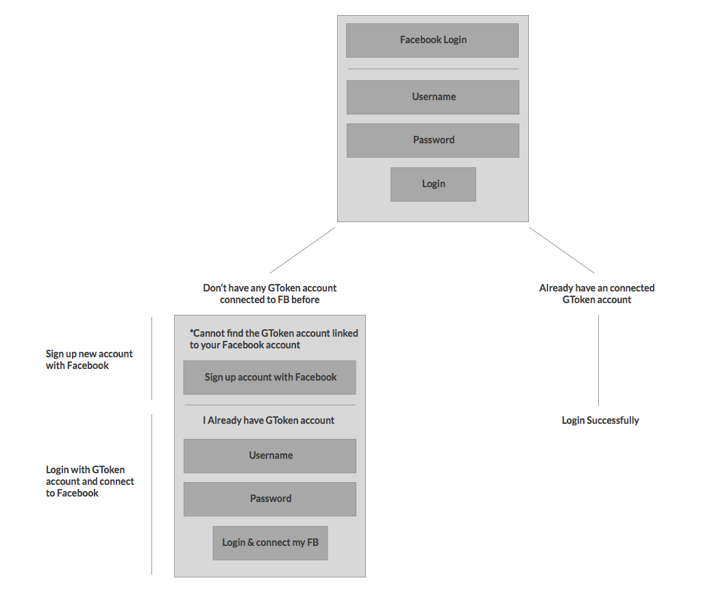
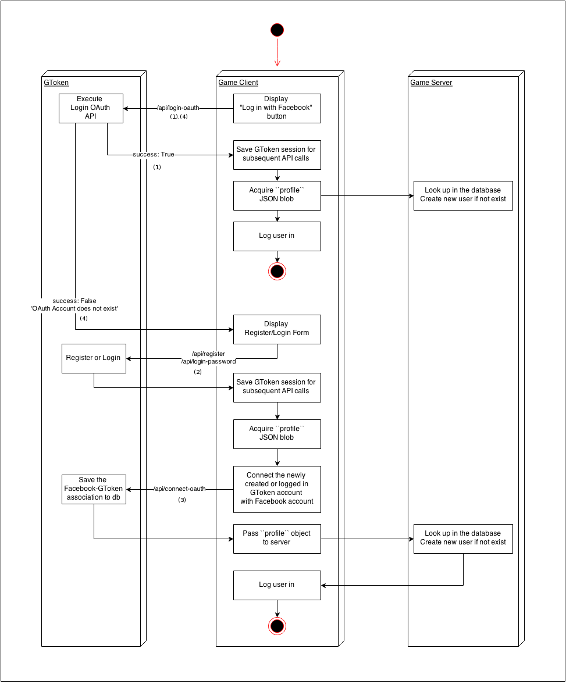
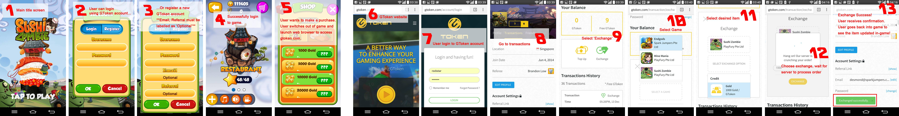

游戏对接所需API
===============

我们尽量保持这个API文档的完整，它的目的是给出一个通用的结构和文档的说明，API可能在以后添加扩展。

.. 内容::

版本
----

每个API有独立URL，如版本号：

* ``/api/1/login``
* ``/api/2/login``

不同版本在不同的目录，会和旧版本共存尽可能长时间。 

API调用可能扩展但不增加它的版本号。这通常意味着增加新的可选字段，测试后会发布在正式网站调用。如果你没有使用最新的可选字段，不需要做任何更改，不会影响你已经写好的调用。

如果API调用必须修改现有客户端调用，会发布一个新的版本。

每个API调用可具有其自己的版本号。建议使用最新的版本，如果你决定使用不同版本的API，请仔细了解两者的区别，最好能做到全部兼容。

常用的数据结构
--------------

介绍 (Profile)
``````````````

代表客户的帐户信息，具有下列键JSON对象：

============================= ======= =====================================
Key                           Type    Notes
============================= ======= =====================================
``uid``                       int
``account``                   string  Unique username
``nickname``                  string
``email``                     string
``gender``                    string
``vip``                       string  "standard", "gold", or null
``country_code``              string  Country name
``goplay_token``              decimal Play Token balance
``free_goplay_token``         decimal Free Play Token balance
``gtoken (deprecated)``       decimal Play Token balance
``free_gtoken (deprecated``   decimal Free Play Token balance
============================= ======= =====================================

兑换 (Exchange)
```````````````

兑换的信息，有以下关键的JSON对象：

================================ ======= =====================================
Key                              Type    Notes
================================ ======= =====================================
``transaction_id``               uuid
``exchange_option_type``         string  'CreditType', or 'Package'
``exchange_option_identifier``   string  Vendor-specified unique string to identify the package/credit
``goplay_token_value``           decimal The value of Play Token of the exchange
``gtoken_value (deprecated)``    decimal The value of Play Token of the exchange
``quantity``                     int     Always be 01 in case ``exchange_option_type`` is ``Package``
``is_free``                      bool    ``True`` when the exchange uses Free Play Token
================================ ======= =====================================

游戏统计 (Game Stat)
````````````````````

代表游戏统计，有以下关键的JSON对象：

================================ ======= =====================================
Key                              Type    Notes
================================ ======= =====================================
``title``                        string
``value``                        string
``public``                       bool    Determine if the stat is visible to public profile or not
================================ ======= =====================================

朋友 (Friends)
``````````````

朋友相关的信息，有以下关键的JSON对象：

================================ ======= =====================================
Key                              Type    Notes
================================ ======= =====================================
``uid``                          int
``account``                      string
``email``                        string  
``nickname``                     string  
``vip``                          string  "standard", "gold", or null
``avatar``                       string  
``country_code``                 string  Country name
``bio``                          string  
================================ ======= =====================================

API调用
-------

``POST /account/register``
``````````````````````````

用于游戏程序注册一个客户账户，这意味着用户没有任何现有的帐户，并填写了必要注册信息。

**Endpoint**: ``/api/1/account/register``

**要求**:

================= ====== ==============================
Parameter         Type   Notes
================= ====== ==============================
``username *``    string Must be unique
``password *``    string 
``email``         string
``nickname``      string
``gender``        string "male", "female", or "other"
``game_id *``     guid
``referral_code`` string
``ip_address``    string If not provided, use the IP address of requester
``country_code``  string If one of two fields: ``country_code`` and ``country name`` not provided, user country will be automatically filled based on ``ip_address`` field.
``country_name``  string
================= ====== ==============================

**响应 (JSON)**:

================= ======= ==============================
Key               Type    Notes
================= ======= ==============================
``success``       bool
``message``       string  Human-readable error message
``error_code``    string  Error Code
``session``       string  Access token for later requests
``profile``       profile See ``profile`` definition above
================= ======= ==============================

****错误消息**:

* EXISTING_USERNAME_EMAIL - 'Account with such username/email already exists'
* MISSING_FIELDS - 'Required field(s) is blank'
* INVALID_GAME_ID - 'Invalid Game ID'
* USERNAME_LENGTH - 'Username is between 3-20 characters'
* INVALID_USERNAME - 'Username does not accept special characters'
* PASSWORD_LENGTH - 'Password must be more than 3 characters'
* INVALID_COUNTRY - 'Invalid country code or country name'

``POST /account/login-password``
````````````````````````````````

用Goplay的用户名和密码登录。该帐户必须已经存在。


**Endpoint**: ``/api/1/account/login-password``

**要求**:

================= ====== ==============================
Parameter         Type   Notes
================= ====== ==============================
``username *``    string
``password *``    string
``game_id *``     guid
================= ====== ==============================

**响应 (JSON)**:

================= ======= ================================
Key               Type    Notes
================= ======= ================================
``success``       bool
``message``       string  Human-readable error message
``error_code``    string  Error Code
``session``       string  Access token for later requests
``profile``       profile See ``profile`` definition above
================= ======= ================================

**错误消息**:

* INVALID_USN_PWD - 'Username or Password is incorrect'
* MISSING_FIELDS - 'Required field(s) is blank'
* INVALID_GAME_ID - 'Invalid Game ID'

``POST /account/login-oauth``
`````````````````````````````

通过第三方OAuth的提供商，比如Facebook登录。请注意，此API将不注册隐含的用户如果帐户不存在，而是返回一个错误消息代替。


**Endpoint**: ``/api/1/account/login-oauth``

**要求**:

================= ====== ==========================================
Parameter         Type   Notes
================= ====== ==========================================
``service *``     string Identifies the third-party service used
``token *``       string Access token returned by third party
``game_id *``     guid
================= ====== ==========================================

**响应 (JSON)**

================= ======= ================================
Key               Type    Notes
================= ======= ================================
``success``       bool
``message``       string  Human-readable error message
``error_code``    string  Error Code
``session``       string  Access token for later requests
``profile``       profile See ``profile`` definition above
================= ======= ================================

**错误消息**:

* NON_EXISTING_OAUTH - 'OAuth Account does not exist'
* MISSING_FIELDS - 'Required field(s) is blank'
* INVALID_GAME_ID - 'Invalid Game ID'
* FACEBOOK_ACCESS_ERROR - 'An active access token must be used to query information about the current user'
* NOT_SUPPORTED_OAUTH_PROVIDER - 'The OAuth Provider is not supported'

.. ``POST /account/connect-password``
.. ``````````````````````````````````

.. Adds a password-based login to an existing account, which must not have one already (i.e. it has only OAuth login).

.. **Endpoint**: ``/api/1/account/connect-password``

.. **要求**:

.. ================= ====== ==========================================
.. Parameter         Type   Notes
.. ================= ====== ==========================================
.. ``session``       string Access token returned by previous login
.. ``game_id``       guid
.. ``username``      string
.. ``password``      string
.. ================= ====== ==========================================

.. **响应 (JSON)**

.. ================= ======= ================================
.. Key               Type    Notes
.. ================= ======= ================================
.. ``success``       bool
.. ``message``       string  Human-readable error message
.. ``error_code``    string  Error Code
.. ================= ======= ================================


``POST /account/connect-oauth``
```````````````````````````````

增加更多的OAuth登录现有帐户。一个帐户可以有多个的OAuth登录。

**Endpoint**: ``/api/1/account/connect-oauth``

**要求**:

================= ====== ==========================================
Parameter         Type   Notes
================= ====== ==========================================
``session *``     string Access token returned by previous login
``game_id *``     guid
``service *``     string Identifies the third-party service used
``token *``       string Access token returned by third party
================= ====== ==========================================

**响应 (JSON)**

================= ======= ================================
Key               Type    Notes
================= ======= ================================
``success``       bool
``message``       string  Human-readable error message
``error_code``    string  Error Code
================= ======= ================================

**错误消息**:

* EXISTING_OAUTH - 'OAuth Account already exists'
* INVALID_SESSION - 'Invalid Session'
* MISSING_FIELDS - 'Required field(s) is blank'
* INVALID_GAME_ID - 'Invalid Game ID'
* NOT_SUPPORTED_OAUTH_PROVIDER - 'The OAuth Provider is not supported'

``POST /account/disconnect-oauth``
``````````````````````````````````

从现有帐户断开OAuth登录。

**Endpoint**: ``/api/1/account/disconnect-oauth``

**要求**

================= ====== ==========================================
Parameter         Type   Notes
================= ====== ==========================================
``session *``     string Access token returned by previous login
``game_id *``     guid
``service *``     string Identifies the third-party service used
``token *``       string Access token returned by third party
================= ====== ==========================================

**响应 (JSON)**

================= ======= ================================
Key               Type    Notes
================= ======= ================================
``success``       bool
``message``       string  Human-readable error message
``error_code``    string  Error Code
================= ======= ================================

**错误消息**:

* OAUTH_USER_NOT_CONNECTED - 'OAuth Account and Customer Account are not connected'
* NON_EXISTING_OAUTH - 'OAuth Account does not exist'
* INVALID_SESSION - 'Invalid Session'
* MISSING_FIELDS - 'Required field(s) is blank'
* INVALID_GAME_ID - 'Invalid Game ID'
* FACEBOOK_ACCESS_ERROR - 'An active access token must be used to query information about the current user'
* NOT_SUPPORTED_OAUTH_PROVIDER - 'The OAuth Provider is not supported'

``POST /account/check-oauth-connection``
````````````````````````````````````````

查询给定的帐户（会话）如果OAuth的登录（访问令牌）已经加入。

**Endpoint**: ``/api/1/account/check-oauth-connection``

**要求**

================== ====== ==========================================
Parameter          Type   Notes
================== ====== ==========================================
``session *``      string Access token returned by previous login
``game_id *``      guid
``service *``      string Identifies the third-party service used
``token *``        string Access token returned by third party
================== ====== ==========================================

**响应 (JSON)**

================== ======= =========================================
Key                Type    Notes
================== ======= =========================================
``success``        bool    ``True`` indicates the connection was made
``message``        string  Human-readable error message
``error_code``     string  Error Code
================== ======= =========================================

**错误消息**:

* OAUTH_ALREADY_CONNECTED - 'OAuth Account is connected already'
* NON_EXISTING_OAUTH - 'OAuth Account does not exist'
* MISSING_FIELDS - 'Required field(s) is blank'
* INVALID_GAME_ID - 'Invalid Game ID'
* NOT_SUPPORTED_OAUTH_PROVIDER - 'The OAuth Provider is not supported'

``POST /account/profile``
`````````````````````````

返回登录用户的档案。可用于检查一个会话令牌是否仍然有效。

**Endpoint**: ``/api/1/account/profile``

**要求**

================= ====== ==========================================
Parameter         Type   Notes
================= ====== ==========================================
``session *``     string Access token returned by previous login
``game_id *``     guid
================= ====== ==========================================

**响应 (JSON)**

================= ======= ================================
Key               Type    Notes
================= ======= ================================
``success``       bool
``message``       string  Human-readable error message
``error_code``    string  Error Code
``profile``       profile See ``profile`` definition above
================= ======= ================================

**错误消息**:

* INVALID_SESSION - 'Invalid Session'
* INVALID_GAME_ID - 'Invalid Game ID'

``POST /account/profile-edit``
``````````````````````````````

更新登录用户的配置文件。参数可以被省略，并且这些字段将保持不变。

**Endpoint**: ``/api/1/account/profile-edit``

**要求**

================= ====== ==========================================
Parameter         Type   Notes
================= ====== ==========================================
``session *``     string Access token returned by previous login
``game_id *``     guid
``email``         string Must be unique
``nickname``      string
``gender``        string "male", "female", or "other"
================= ====== ==========================================

**响应 (JSON)**

================= ======= ================================
Key               Type    Notes
================= ======= ================================
``success``       bool
``message``       string  Human-readable error message
``error_code``    string  Error Code
``profile``       profile See ``profile`` definition above
================= ======= ================================

**错误消息**

* INVALID_SESSION - 'Invalid Session'
* INVALID_GAME_ID - 'Invalid Game ID'

``POST /account/grant-chat-token``
``````````````````````````````````

授予经由GToken登录访问聊天系统的用户。

**Endpoint**: ``/api/1/account/grant-chat-token``

**要求**:

================= ====== ==============================
Parameter         Type   Notes
================= ====== ==============================
``game_id *``     guid
``session *``     string
================= ====== ==============================

**响应 (JSON)**:

================= ======= ================================
Key               Type    Notes
================= ======= ================================
``success``       bool
``message``       string  Human-readable error message
``error_code``    string  Error Code
``token``         string  Access token for later requests
================= ======= ================================

**错误消息**:

* INVALID_SESSION - 'Invalid Session'
* INVALID_GAME_ID - 'Invalid Game ID'


``POST /friend/friend-list``
````````````````````````````

**Endpoint**: ``/api/1/friend/friend-list``

**要求**

===================== ======= ==========================================
Parameter             Type    Notes
===================== ======= ==========================================
``session *``         string  Access token returned by previous login
``game_id *``         uuid
``include_profile``   boolean If ``true``, return multiple ``profile`` objects. If ``false``, return an array of username. Default to ``false``
``status``            string  Can be either ``accepted``, ``pending``, ``waiting`` or ``rejected``. Default to ``accepted``
===================== ======= ==========================================

**响应 (JSON)**

================= ======= ================================
Key               Type    Notes
================= ======= ================================
``success``       bool
``message``       string  Human-readable error message
``error_code``    string  Error Code
``friends``       JSON    ``{<username>:<profile>}`` or ``[<username>]`` depends on ``include_profile`` value
================= ======= ================================

**错误消息**

* INVALID_SESSION - 'Invalid Session'
* INVALID_GAME_ID - 'Invalid Game ID'
* MISSING_FIELDS - 'Required field(s) is blank'

``POST /friend/search``
```````````````````````

返回用户列表与关键词匹配的用户名，昵称或电子邮件。顺序是先朋友，后陌生人。

**Endpoint**: ``/api/1/friend/search``

**要求**

===================== ======= ==========================================
Parameter             Type    Notes
===================== ======= ==========================================
``session *``         string  Access token returned by previous login
``game_id *``         uuid
``keyword *``         string  
``offset``            int     Default 0
``count``             int     Default 10
===================== ======= ==========================================

**响应 (JSON)**

================= ======= ================================
Key               Type    Notes
================= ======= ================================
``success``       bool
``message``       string  Human-readable error message
``error_code``    string  Error Code
``users``         JSON    ``[{user_profile}, {user_profile},..]``
``count``         int     The total count of search result
================= ======= ================================

**错误消息**

* INVALID_SESSION - 'Invalid Session'
* INVALID_GAME_ID - 'Invalid Game ID'
* MISSING_FIELDS - 'Required field(s) is blank'

``POST /friend/send-request``
`````````````````````````````

发送好友请求。

**Endpoint**: ``/api/1/friend/send-request``

**要求**

===================== ====== ==========================================
Parameter             Type   Notes
===================== ====== ==========================================
``session *``         string Access token returned by previous login
``game_id *``         uuid
``friend_username *`` string GToken unique username
===================== ====== ==========================================

**响应 (JSON)**

================= ======= ================================
Key               Type    Notes
================= ======= ================================
``success``       bool
``message``       string  Human-readable error message
``error_code``    string  Error Code
================= ======= ================================

**错误消息**

* INVALID_GAME_ID - 'Invalid Game ID'
* INVALID_SESSION - 'Invalid Session'
* MISSING_FIELDS - 'Required field(s) is blank'
* NON_EXISTING_USER - 'User Account does not exist'
* REQUEST_ALREADY_SENT - 'Transaction has already been processed'


``POST /friend/respond-request``
`````````````````````````````````

接受/拒绝从GToken的好友请求。也可用于解除好友关系。

**Endpoint**: ``/api/1/friend/respond-request``

**要求**

===================== ====== ==========================================
Parameter             Type   Notes
===================== ====== ==========================================
``session *``         string Access token returned by previous login
``game_id *``         uuid
``friend_username *`` string GToken unique username
``status *``          string Must be ``accepted`` or ``rejected``
===================== ====== ==========================================

**响应 (JSON)**

================= ======= ================================
Key               Type    Notes
================= ======= ================================
``success``       bool
``message``       string  Human-readable error message
``error_code``    string  Error Code
``friends``       Array   Array of the user's friends' username, can be used for reconfirmation
================= ======= ================================

**错误消息**

* INVALID_GAME_ID - 'Invalid Game ID'
* INVALID_SESSION - 'Invalid Session'
* MISSING_FIELDS - 'Required field(s) is blank'
* NON_EXISTING_USER - 'User Account does not exist'
* NON_EXISTING_FRIEND_REQUEST - 'Friend request does not exist'
* INVALID_FRIEND_REQUEST_STATUS - 'Friend request status must be either `accepted` or `rejected`'

``POST /game/save-progress``
````````````````````````````

允许游戏客户端直接保存进度在GToken服务器。进度保存在一个字符串字段（这样的游戏保存数据可以是文本XML或JSON），或所有扩展名的文件。进度保存包含meta field 和 a saved_at datetime。每次用户想要保存的数据，开发者最好检查GToken服务器上的数据的实际状态。随后游戏将要决定做什么，提示用户有一个更近的游戏保存在服务器上，或只是将其覆盖而不提示，例如，如果游戏本地已经保存的很好，游戏客户端可以选择不提示玩家覆盖。

**Endpoint**: ``/api/1/game/save-progress``

**要求**

=============================== ====== ==========================================
Parameter                       Type   Notes
=============================== ====== ==========================================
``session *``                   string Access token returned by previous login
``game_id *``                   guid
``data``                        string Game save content
``file``                        file   Can be of any extension. The ``POST`` content-type request must be ``multipart/form-data`` for this to work. More info at link_
``meta``                        string Meta data about game save. Useful when dealing with multiple concurrent devices
=============================== ====== ==========================================

.. _link: http://www.w3.org/TR/html401/interact/forms.html#h-17.13.4.2

**响应 (JSON)**

================= ========= ================================
Key               Type      Notes
================= ========= ================================
``success``       bool
``message``       string    Human-readable error message
``error_code``    string    Error Code
``saved_at``      timestamp UTC timestamp of the save time
================= ========= ================================

**错误消息**:

* MISSING_FIELDS - 'Required field(s) is blank'
* INVALID_SESSION - 'Invalid Session'
* INVALID_GAME_ID - 'Invalid Game ID'


``POST /game/get-progress``
```````````````````````````

允许游戏客户端直接从GToken服务器检索进度。进度保存在一个字符串字段（这样的游戏保存数据可以是文本XML或JSON），或所有扩展名的文件。进度保存包含meta field 和 a saved_at datetime。每次用户想要保存的数据，开发者最好检查GToken服务器上的数据的实际状态。随后游戏将要决定做什么，提示用户有一个更近的游戏保存在服务器上，或只是将其覆盖而不提示，例如，如果游戏本地已经保存的很好，游戏客户端可以选择不提示玩家覆盖。

**Endpoint**: ``/api/1/game/get-progress``

**要求**

=============================== ====== ==========================================
Parameter                       Type   Notes
=============================== ====== ==========================================
``session *``                   string Access token returned by previous login
``game_id *``                   guid
``send_data``                   bool   ``True`` or ``False``. Optional, default True. Choose if the response should include the game save data, decrease traffic on server and client when only ``meta`` data and ``save_at`` timestamp are needed.
=============================== ====== ==========================================

**响应 (JSON)**

================= ========= ================================
Key               Type      Notes
================= ========= ================================
``success``       bool
``message``       string    Human-readable error message
``error_code``    string    Error Code
``data``          string
``meta``          string
``file``          string    URL to the storage file (protected)
``saved_at``      timestamp
================= ========= ================================

**错误消息**:

* MISSING_FIELDS - 'Required field(s) is blank'
* INVALID_SESSION - 'Invalid Session'
* INVALID_GAME_ID - 'Invalid Game ID'


``POST /game/read-progress``
````````````````````````````

允许游戏客户端直接从GToken服务器检索进度存储文件。进度保存在一个字符串字段（这样的游戏保存数据可以是文本XML或JSON），或所有扩展名的文件。进度保存包含meta field 和 a saved_at datetime。每次用户想要保存的数据，开发者最好检查GToken服务器上的数据的实际状态。随后游戏将要决定做什么，提示用户有一个更近的游戏保存在服务器上，或只是将其覆盖而不提示，例如，如果游戏本地已经保存的很好，游戏客户端可以选择不提示玩家覆盖。

**Endpoint**: ``/api/1/game/read-progress``

**要求**

=============================== ====== ==========================================
Parameter                       Type   Notes
=============================== ====== ==========================================
``session *``                   string Access token returned by previous login
``game_id *``                   guid
=============================== ====== ==========================================

**响应 (JSON)**

**Downloadable file as attachment.**

In case of error:

================= ========= ================================
Key               Type      Notes
================= ========= ================================
``success``       bool
``message``       string    Human-readable error message
``error_code``    string    Error Code
================= ========= ================================

**错误消息**:

* MISSING_FIELDS - 'Required field(s) is blank'
* INVALID_SESSION - 'Invalid Session'
* INVALID_GAME_ID - 'Invalid Game ID'
* NON_EXISTING_FILENAME - 'Filename does not exist'
* ERROR_READING_FILE

``POST /game/update-game-stats``
````````````````````````````````

允许游戏客户端直接保存游戏状态到GToken服务器。状态被保存为一个字符串（JSON格式）与saved_at日期时间。每次用户想要保存的数据，在开发者最好检查GToken服务器上的数据的实际状态。

**Endpoint**: ``/api/1/game/update-game-stats``

**要求**

=============================== ====== ==========================================
Parameter                       Type   Notes
=============================== ====== ==========================================
``session *``                   string Access token returned by previous login
``game_id *``                   guid
``stats *``                     array  Array of ``Game Stat``. See ``Game Stat`` definition above
=============================== ====== ==========================================

**响应 (JSON)**

================= ========= ================================
Key               Type      Notes
================= ========= ================================
``success``       bool
``message``       string    Human-readable error message
``error_code``    string    Error Code
``saved_at``      timestamp UTC timestamp of the save time
================= ========= ================================

**错误消息**:

* MISSING_FIELDS - 'Required field(s) is blank'
* INVALID_SESSION - 'Invalid Session'
* INVALID_GAME_ID - 'Invalid Game ID'
* INVALID_GAME_STAT - 'Invalid stat format. A stat JSON must include 3 keys title, value and public with their values.'


.. ``POST /game/reward-gcoin``
.. ``````````````````````````````

.. Allows game client to deduce GToken balance directly. Only available for Android due to in-app purchase policies.

.. **Endpoint**: ``/api/1/game/reward-gcoin``

.. **要求**

.. =============================== ============= ==========================================
.. Parameter                       Type          Notes
.. =============================== ============= ==========================================
.. ``session *``                   string        Access token returned by previous login
.. ``game_id *``                   guid
.. ``amount *``                    decimal(16,2) Amount of GCoin to be rewarded
.. ``description``                 string        Human-readable explanation on why GCoin is rewarded
.. =============================== ============= ==========================================

.. **响应 (JSON)**

.. ================= ==================== ================================
.. Key               Type                 Notes
.. ================= ==================== ================================
.. ``success``       bool
.. ``message``       string               Human-readable error message
.. ``error_code``    string               Error Code
.. ``transaction``   GCoin Transaction
.. ================= ==================== ================================

.. **错误消息**:

.. * 'Required field(s) is blank'
.. * 'Invalid Session'
.. * 'Invalid Game ID'
.. * 'Invalid amount'


|
|

兑换请求
========

通用的API
---------

``POST /transaction/update-external-exchange``
``````````````````````````````````````````````

直接在GToken数据库更新兑换信息，大多是从应用程序内购买。这将有助于GToken一次性处理兑换选项。

**Endpoint**: ``/api/1/transaction/update-external-exchange``

**要求**:

=============================== ====== ==============================
Parameter                       Type   Notes
=============================== ====== ==============================
``session *``                   string Access token returned by previous login
``game_id *``                   guid
``transaction_id``              string The ID of the external exchange, for identity
``exchange_option_identifier``  string Vendor-specific unique string to identify the package/credit
=============================== ====== ==============================

**响应 (JSON)**

================= ====== ==========================================
Key               Types  Notes
================= ====== ==========================================
``success``       bool
``message``       string Human-readable error message
``error_code``    string Error Code
================= ====== ==========================================

**错误消息**:

* INVALID_GAME_ID - 'Invalid Game ID'
* INVALID_SESSION - 'Invalid Session'
* INVALID_EXCHANGE_OPTION - 'Invalid Exchange Option Identifier'
* EXCHANGE_RECORDED - 'Exchange has already been recorded'

自己有服务器的游戏兑换流程
--------------------------

每个游戏与GToken集成后将被保存以下数据

======================== ============ ====================================
Column                   Type         Notes
======================== ============ ====================================
``id``                   serial
``guid``                 uuid         Used as game_id in APIs. Secret. Also known as ``BasicKey`` in API v0
``name``                 string
``endpoint``             string       The destination of the request. *Must be https in production system*
``client_id``            string       Provided by respective game studio, to be used for further security reasons the studio wants to apply
``client_secret``        string       Provided by respective game studio, to be used for further security reasons the studio wants to apply
======================== ============ ====================================

当有玩家在GToken站点兑换，下面的请求将被发送到游戏服务器执行。

**Endpoint**: 回调的地址在Gtoken提供的后台，游戏信息中的：game.endpoint定义

**要求**

======================================= ======== ==========================================
Parameter                               Type     Notes
======================================= ======== ==========================================
``game_id``                             guid     
``transaction_id``                      uuid     
``user_id``                             int       GToken's user id
``exchange_option_type``                string   ``CreditType`` or ``Package``
``exchange_option_id (deprecated)``     int       The id stored in the database of the exchange option. Notice that as ``CreditType`` and ``Package`` are stored in different tables, the id therefore might not be unique in case the game uses both ``CreditType`` and ``Package``. The combination of ``exchange_option_type`` and ``exchange_option_id`` is, on another hand, always unique. *Deprecated* new integration should use ``exchange_option_identifier``
``exchange_option_identifier``          string   Vendor-specified unique string to identify the package/credit
``goplay_token_value``                  decimal  The value in Play Token of the exchange
``gtoken_value (deprecated)``           decimal  The value in Play Token of the exchange
``quantity``                            int      Always be 01 in case ``exchange_option_type`` is ``Package``
``is_free``                             bool     ``True`` if the transaction is on Free Play Token
``cliend_id``                           string
``client_secret``                       string
======================================= ======== ==========================================

**响应 (JSON)**

================= ======= =================================
Key               Type    Notes
================= ======= =================================
``success``       bool
``message``       string  Human-readable error message
================= ======= =================================

没有服务器的游戏兑换流程
------------------------

``POST /transaction/get-unfulfilled-exchanges``
```````````````````````````````````````````````

返回GToken网站未完成的相关兑换名单 

**Endpoint**: ``/api/1/transaction/get-unfulfilled-exchanges``

**要求**:

================= ====== ==============================
Parameter         Type   Notes
================= ====== ==============================
``session *``     string Access token returned by previous login
``game_id *``     guid
================= ====== ==============================

**响应 (JSON)**

================= ====== ==========================================
Key               Types  Notes
================= ====== ==========================================
``success``       bool
``message``       string Human-readable error message
``exchanges``     array  Array of ``Exchange``. See ``Exchange`` definition above
================= ====== ==========================================

**错误消息**:

* INVALID_GAME_ID - 'Invalid Game ID'
* INVALID_SESSION - 'Invalid Session'


``POST /transaction/fulfill-exchange``
``````````````````````````````````````

完成对应的GToken网站兑换

**Endpoint**: ``/api/1/transaction/fulfill-exchange``

**要求**:

==================== ====== ==============================
Parameter            Type   Notes
==================== ====== ==============================
``session *``        string Access token returned by previous login
``game_id *``        guid
``transaction_id *`` uuid
==================== ====== ==============================

**响应 (JSON)**

================= ============ ==========================================
Key               Types        Notes
================= ============ ==========================================
``success``       bool
``message``       string       Human-readable error message
``error_code``    string       Error Code
``exchange``      ``Exchange`` The detail of the fulfilled exchange, for double checking. See ``Exchange`` definition above
================= ============ ==========================================

**错误消息**:

* INVALID_GAME_ID - 'Invalid Game ID'
* INVALID_SESSION - 'Invalid Session'
* INVALID_TRANSACTION_ID - 'Invalid Transaction ID'
* TRANSACTION_ALREADY_PROCESSED - 'Transaction has already been processed' 


``POST /transaction/reject-exchange``
`````````````````````````````````````

拒绝GToken网站上的兑换。拒绝的交易被标注为``failure``和用户的余额被退还。

**Endpoint**: ``/api/1/transaction/reject-exchange``

**要求**:

==================== ====== ==============================
Parameter            Type   Notes
==================== ====== ==============================
``session *``        string Access token returned by previous login
``game_id *``        guid
``transaction_id *`` uuid
==================== ====== ==============================

**响应 (JSON)**

================= ============ ==========================================
Key               Types        Notes
================= ============ ==========================================
``success``       bool
``message``       string       Human-readable error message
``error_code``    string       Error Code
``exchange``      ``Exchange`` The detail of the rejected exchange, for double checking. See ``Exchange`` definition above
================= ============ ==========================================

**错误消息**:

* INVALID_GAME_ID - 'Invalid Game ID'
* INVALID_SESSION - 'Invalid Session'
* INVALID_TRANSACTION_ID - 'Invalid Transaction ID'
* TRANSACTION_ALREADY_PROCESSED - 'Transaction has already been processed' 

|
|

推荐流程
========

Facebook的登录/注册流程
-----------------------
**UI 流程:**



**程序流程：**



** API调用示例：**

(1) ``/api/1/account/login-oauth``

.. image:: images/fb1.png


(2) ``/api/1/account/login-password`` 

.. image:: images/fb2.png


(3) ``/api/1/account/connect-oauth``

.. image:: images/fb3.png


(4) ``/api/1/account/login-oauth``

.. image:: images/fb4.png


玩家POV的兑换流程
-----------------



自己有服务器的游戏兑换流程
--------------------------

.. image:: images/exchange_with_server_flow.png

自己没有服务器的游戏兑换流程
----------------------------

.. image:: images/exchange_no_server_flow.png
