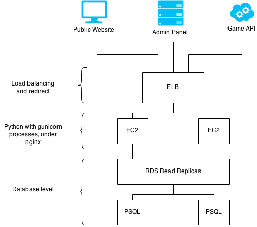
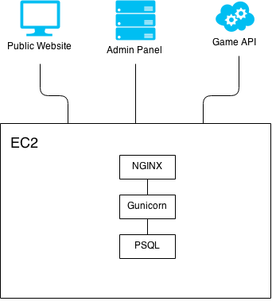

Architecture
============

Production environment

Development environment

Interfaces
----------

There are three inbound interfaces to the system:

* The *Public Website*, used by customers to manage their accounts and make payment
* The *Admin Web App*, used by staff at GoPlay La and game studios to manage the system
* The *Partner API*, used by third-party partner companies to perform authentication and loyalty functions

Elastic Load Balancer (*ELB*)
-----------------------------

ELB_ is an Amazon service which balances incoming requests across a number of backend application nodes. SSL termination will be perform in nginx on each EC2 instance.

.. _ELB: http://docs.aws.amazon.com/ElasticLoadBalancing/latest/DeveloperGuide/SvcIntro.html

Application Instances (EC2)
---------------------------

The application instances run all of the application code. Every instance is identical and can serve requests for any of the available instances. We will initially use two instances (in different availability zones), and increase this number as necessary. Optionally, we can use AWS `Auto Scaling`_ to manage this.

.. _`Auto Scaling`: http://aws.amazon.com/autoscaling/

Database Instances (RDS)
------------------------

We will use AWS' dedicated database instances (`Relational Database Service`_, *RDS*) to run PostgreSQL databases. To increase database availability, we use `Multi-AZ Deployment`_. And to scale beyond the capacity constraints of a single DB Instance, we use `Read Replicas`_.

The database will store both application data and user sessions (but sessions may be moved to a separate cache as a future optimization).

.. _`Relational Database Service`: http://aws.amazon.com/rds/
.. _`Multi-AZ Deployment`: http://aws.amazon.com/rds/faqs/
.. _`Read Replicas`: http://aws.amazon.com/rds/faqs/#replication
