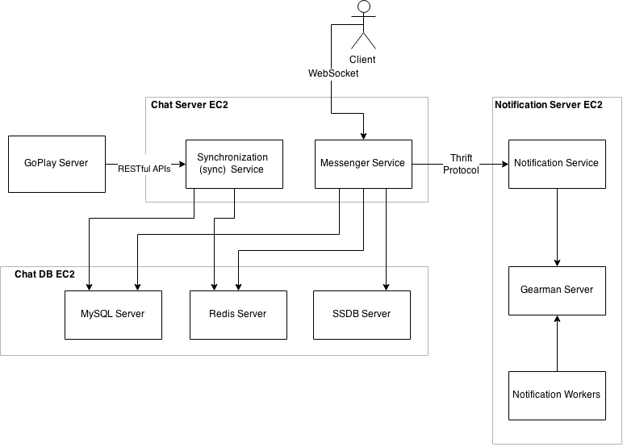

Architecture
============



Interfaces
----------
There are two inbound interfaces to the system:

* The *browsers*, served through GoPlay website, on both desktop and mobile devices.
* The *Mobile Apps* (iOS and Android)

The authentication token is handled (returned, renewed, expired) by sync service.

Messenger Service
-----------------

Messenger Service controll all connections and messages in the system. Each client performs a handshake to server and a websocket connection will be made and kept alive.

Synchronization (sync) Service
------------------------------

The service facilitate communication between GoPlay server and Chat server. The synchronization involves all users and their social graphs (friend list). The service also issues authentication token for client communication with messenger service. Token is issued via GoPlay server and kept on client.

Notification Service
--------------------

The service notifies related users on event basis. It's available for chat and feed notifications in a similar fashion to Facebook Notification Center.

Gearman server
``````````````

<some description on what we are using gearman for>

Notification Worker
```````````````````

Gets jobs from gearman server and saves data into database. The process is run in background to reduce latency. For scalability, worker could be restarted on new config, or clone into more instances.

MYSQL Database
--------------

MySQL keep the final copy of all data in chat system. Due to the high traffic nature of a messenger system, data in MySQL is only used for backup and report.

Redis Database
--------------

Redis is a key-value data store. Redis data is kept entirely in server memory, due to accessibility and performance concerns. Redis comes with built-in persistence and more data-types, compared to its closest counterpart, Memcached. In messenger system, Redis is used to keep and serve user info and social graph.

SSDB Database
-------------

SSDB positions itself as a Redis replacement though our engineers believe otherwise. SSDB is used to keep your message history, which is requested less freqnetly than user info and social graph. SSDB also consumes less memery than Redis.
